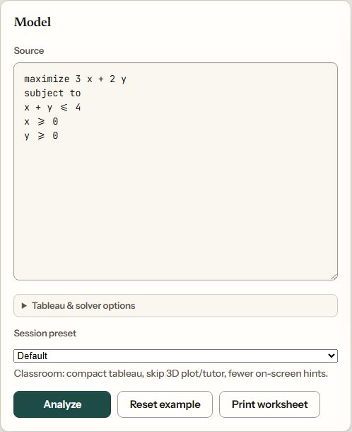
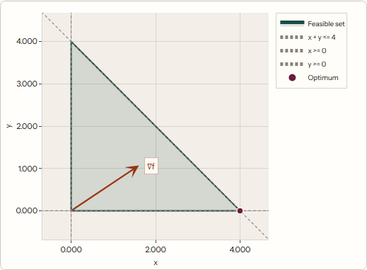
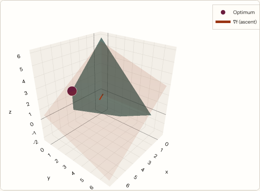
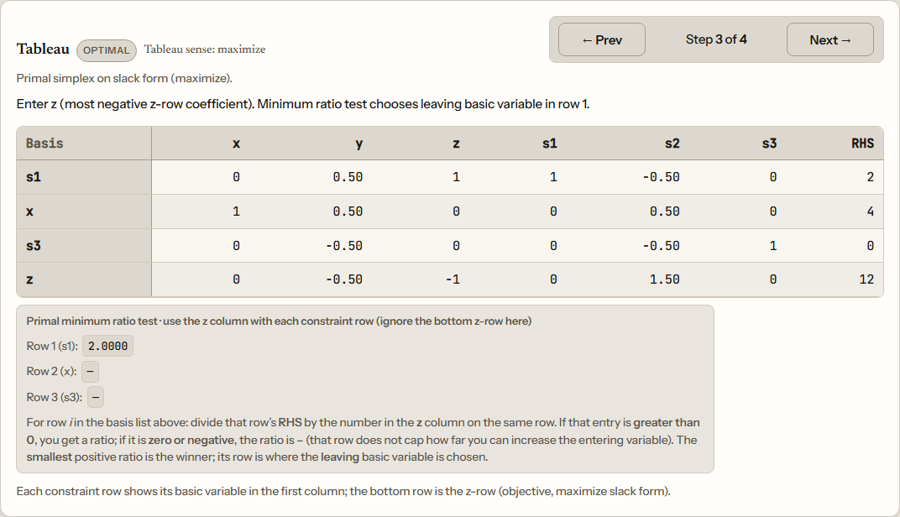

# Linear programming tutor

Small **linear programming** playground: type a model in a simple text format, **analyze** it with SciPy/HiGHS, see the **feasible region** (2D or 3D when it applies), optional **graphical tutor**, and step through a **simplex tableau** when the backend can build one.

## Screenshots

**Model** — objective, `subject to`, constraints, then **Analyze**.

<p align="center">
  
</p>

**Feasible set in 2D** (two decision variables) and **in 3D** (three variables; drag the Plotly view to rotate).

<p align="center">
  
  &nbsp;&nbsp;
  
</p>

**Tableau** — step through pivots; optional ratio panel for primal/dual steps.

<p align="center">
  
</p>

## Features

- **Text DSL** — `maximize` / `minimize`, `subject to`, linear constraints (`<=`, `>=`, `=`, strict `<` / `>` with a documented ε relaxation).
- **Solve & optimum** — objective value and optimal point when the solver reports optimal.
- **Plots** — **Plotly** feasible region in 2D; 3D polyhedron when the model supports it (use **Default** or **Self-study** preset so 3D is shown; **Classroom** skips the 3D plot).
- **Tableau** — primal (and related modes where supported), step-by-step snapshots, optional **Bland** rule, **dual** / **big-M** / **minimize** tableau options, and **verification** against the numeric solver when available.
- **Study presets** — compact tableau vs full hints; Classroom skips 3D plot/tutor.
- **Print worksheet** — layout tuned for a clean printed page from the browser.
- **CI** — GitHub Actions runs backend tests and frontend typecheck/build (no Actions usage charges for standard jobs on a **public** repo).

## Stack

| Layer    | Tech |
| -------- | ---- |
| API      | **FastAPI**, **SciPy** `linprog` (**HiGHS**), tableau cross-checks where implemented |
| UI       | **SvelteKit 5**, **Svelte 5**, **Vite**, **TypeScript** |
| Graphics | **Plotly.js** |

## Quick start

**Backend** (Python with [uv](https://docs.astral.sh/uv/)):

```bash
cd backend
uv sync
uv run uvicorn backend.main:app --reload --host 127.0.0.1 --port 8000
```

**Frontend** ([Bun](https://bun.sh/) for installs and scripts; no `package-lock.json` in this repo):

```bash
cd frontend
bun install
bun run dev
```

The dev server proxies `/api` and `/health` to **port 8000**. Open the URL Vite prints (default `http://127.0.0.1:5173`).

**Repo root** (API + UI together, if `uv` and `bun` are on your `PATH`):

```bash
bun install
bun run dev
```

## API

- `POST /api/lp/analyze` — JSON body `{ "source": "<DSL>" }`; optional fields such as `tableau_mode` (`auto`, `primal`, `dual`, `big_m`), `use_blands_rule`, `big_m_value`. Response may include `modeling_notes` (e.g. strict inequality handling).
- `GET /health`

## Develop

- Typecheck: `cd frontend && bun run check`
- Production build: `cd frontend && bun run build`

## Readme screenshots (maintainers)

1. Stop anything already bound to **8000** / **5173** if you want a predictable stack.
2. From repo root: **`bun run dev`** (or start API and `cd frontend && bun run dev` separately).
3. Once: **`bun run readme:screenshots:install`** (Chromium for Playwright).
4. **`bun run readme:screenshots`** — overwrites the four PNGs under `docs/readme/` used in this readme.

Optional env: `README_SCREENSHOT_BASE_URL` (default `http://localhost:5173` to match Vite’s usual dev URL), `README_SCREENSHOT_API_URL` (default `http://127.0.0.1:8000`, for a startup health warning only).

## Roadmap

Shipped scope and ideas: [ROADMAP.md](ROADMAP.md).

## Tests

```bash
cd backend && uv run pytest
```
